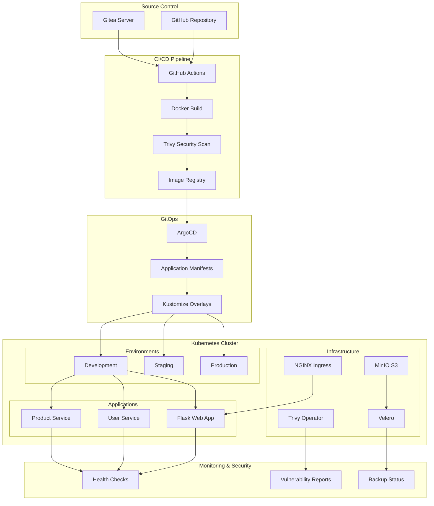
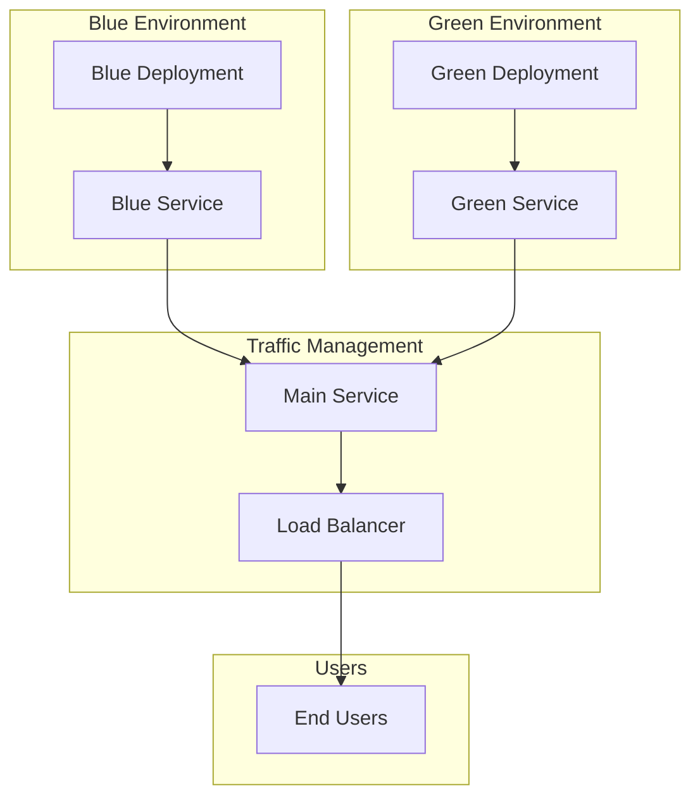

# 🚀 Unified Production-Ready DevOps Pipeline

A comprehensive DevOps ecosystem integrating Flask web application with microservices architecture, featuring GitOps with ArgoCD, automated CI/CD, container security scanning, multi-environment deployment, blue-green strategy, and backup & disaster recovery.

## ⚡ Quick Start

### Fresh Installation (4 Simple Steps)

```bash
# Step 1: Install prerequisites
chmod +x setup_prereqs.sh && ./setup_prereqs.sh

# Step 2: Bootstrap Kubernetes cluster (includes registry + Gitea setup)
chmod +x bootstrap_cluster.sh && ./bootstrap_cluster.sh

# Step 3: Deploy applications (GitOps workflow)
chmod +x deploy_pipeline.sh && ./deploy_pipeline.sh

# Step 4: Verify and get access URLs
chmod +x check_env.sh && ./check_env.sh
```

**Then:** Open ports 30080-30085 and 30500 in AWS Security Group and access via `http://YOUR_IP:PORT`

### If Cluster Already Exists (Reset and Recreate)

```bash
# Complete reset and setup with all fixes
chmod +x reset_and_setup.sh && ./reset_and_setup.sh
```

This will delete the existing cluster and recreate with all ports properly mapped.

## 📋 Complete Step-by-Step Guide: Kaise Check Karein Aur Kaise Run Karein

### Prerequisites Check (Pehle Ye Check Karein)

**Important:** Kisi bhi script ko run karne se pehle, yeh ensure karein:

1. **Docker Check:**
   ```bash
   # macOS par Docker Desktop open karein
   # Ya terminal me check karein:
   docker ps
   ```
   Agar error aaye to Docker Desktop start karein.

2. **Required Tools Check:**
   ```bash
   # Ye sab tools installed hone chahiye:
   docker --version
   kubectl version --client
   kind --version
   helm version
   ```

### Step 1: Prerequisites Install Karein

```bash
# Script ko executable banao
chmod +x setup_prereqs.sh

# Run karo
./setup_prereqs.sh
```

**Kya Install Hoga:**
- Docker & Docker Compose
- kubectl (Kubernetes CLI)
- kind (Kubernetes in Docker)
- Helm (Package Manager)
- ArgoCD CLI
- Trivy (Security Scanner)
- Velero (Backup Tool)
- Kustomize
- MkDocs (Documentation)

**Success Message:**
```
[SUCCESS] All prerequisites installed successfully!
```

### Step 2: Cluster Bootstrap Karein

```bash
# Script ko executable banao
chmod +x bootstrap_cluster.sh

# Run karo (ye 5-10 minutes le sakta hai)
./bootstrap_cluster.sh
```

**Kya Create Hoga:**
- ✅ Kubernetes cluster (kind)
- ✅ NGINX Ingress Controller
- ✅ Gitea (Git Server) - Port 30084
- ✅ ArgoCD (GitOps) - Port 30083
- ✅ MinIO (S3 Storage)
- ✅ Trivy Operator (Security)
- ✅ Velero (Backup)

**Success Message:**
```
[SUCCESS] Cluster bootstrap completed successfully!
```

**Important:** Agar error aaye:
- Docker running hai ya nahi check karein
- Sufficient memory/disk space hai ya nahi
- Internet connection active hai

### Step 3: Applications Deploy Karein

```bash
# Script ko executable banao
chmod +x deploy_pipeline.sh

# Run karo
./deploy_pipeline.sh
```

**Kya Deploy Hoga:**
- ✅ Flask Web Application - Port 30080
- ✅ User Service - Port 30081
- ✅ Product Service - Port 30082
- ✅ All Kubernetes manifests
- ✅ ArgoCD applications

### Step 4: Sab Kuch Check Karein

#### 4.1: Complete Environment Check

```bash
# Script ko executable banao
chmod +x check_env.sh

# Run karo - ye sab kuch check karega
./check_env.sh
```

**Yeh Script Check Karega:**
- ✅ Cluster status
- ✅ All namespaces
- ✅ ArgoCD applications
- ✅ Gitea status
- ✅ MinIO status
- ✅ Trivy Operator
- ✅ Velero
- ✅ Application deployments
- ✅ Service endpoints
- ✅ Access URLs

**Output Me Milega:**
- Service URLs
- Credentials
- Health status
- Troubleshooting tips

#### 4.2: Gitea Specific Check (Detailed)

```bash
# Gitea ke liye detailed diagnostic script
chmod +x check_gitea.sh

# Run karo
./check_gitea.sh
```

**Yeh Script Check Karega:**
- ✅ Docker status
- ✅ Kubernetes cluster status
- ✅ Gitea namespace
- ✅ Gitea pods (status, logs)
- ✅ Gitea services (ClusterIP/NodePort)
- ✅ Gitea ingress
- ✅ Port forwarding options
- ✅ Connectivity tests
- ✅ Troubleshooting recommendations

**Output Example:**
```
========================================
Step 1: Checking Docker Status
========================================
[SUCCESS] Docker is running

========================================
Step 2: Checking Kubernetes Cluster
========================================
[SUCCESS] Cluster 'devops-pipeline' exists
[SUCCESS] Cluster is accessible

========================================
Step 4: Checking Gitea Pods
========================================
[SUCCESS] Pod gitea-xxx is running and ready

========================================
Step 5: Checking Gitea Services
========================================
[SUCCESS] Service gitea-http is exposed via NodePort
    NodePort: 30084

========================================
Step 9: NodePort Access Information
========================================
Access Gitea at:
  http://localhost:30084
  http://YOUR_IP:30084
  Credentials: admin / admin123
```

#### 4.3: Manual Checks (Agar Scripts Kaam Na Karein)

**Cluster Status:**
```bash
# Cluster check
kubectl cluster-info
kubectl get nodes

# Sab pods check karo
kubectl get pods -A
```

**Gitea Check:**
```bash
# Gitea pods
kubectl get pods -n gitea

# Gitea services
kubectl get svc -n gitea

# Gitea logs
kubectl logs -n gitea -l app.kubernetes.io/name=gitea --tail=50

# Gitea pod details
kubectl describe pods -n gitea
```

**ArgoCD Check:**
```bash
# ArgoCD pods
kubectl get pods -n argocd

# ArgoCD applications
kubectl get applications -n argocd

# ArgoCD password
kubectl -n argocd get secret argocd-initial-admin-secret -o jsonpath="{.data.password}" | base64 -d && echo
```

**Applications Check:**
```bash
# Dev namespace me sab kuch
kubectl get all -n dev

# Services check
kubectl get svc -n dev

# Pods status
kubectl get pods -n dev
```

### Step 5: Access URLs (Browser Me Open Karein)

**Important:** Pehle AWS Security Group me ports open karein:
- Port 30080 (Flask App)
- Port 30081 (User Service)
- Port 30082 (Product Service)
- Port 30083 (ArgoCD)
- Port 30084 (Gitea)

**Access URLs:**

| Service | URL | Credentials |
|---------|-----|-------------|
| **Flask App** | http://YOUR_IP:30080 | - |
| **User Service** | http://YOUR_IP:30081/api/users | - |
| **Product Service** | http://YOUR_IP:30082/api/products | - |
| **ArgoCD** | http://YOUR_IP:30083 | admin/[password below] |
| **Gitea** | http://YOUR_IP:30084 | admin/admin123 |

**ArgoCD Password Get Karne Ke Liye:**
```bash
kubectl -n argocd get secret argocd-initial-admin-secret -o jsonpath="{.data.password}" | base64 -d && echo
```

### Common Issues Aur Solutions

#### Issue 1: Docker Not Running

**Error:**
```
Cannot connect to the Docker daemon
```

**Solution:**
```bash
# macOS: Docker Desktop open karo
# Linux: 
sudo systemctl start docker
sudo systemctl enable docker
```

#### Issue 2: Cluster Not Accessible

**Error:**
```
The connection to the server localhost:8080 was refused
```

**Solution:**
```bash
# Kubeconfig set karo
kind get kubeconfig --name devops-pipeline > ~/.kube/config
kubectl config use-context kind-devops-pipeline

# Verify
kubectl get nodes
```

#### Issue 3: Gitea Not Opening

**Check Karo:**
```bash
# Detailed Gitea check
./check_gitea.sh

# Ya manually:
kubectl get pods -n gitea
kubectl get svc -n gitea
kubectl logs -n gitea -l app.kubernetes.io/name=gitea
```

**Solutions:**
```bash
# Agar pod running nahi hai:
kubectl describe pod -n gitea <pod-name>

# Agar service NodePort nahi hai:
kubectl patch svc gitea-http -n gitea -p '{"spec":{"type":"NodePort","ports":[{"port":3000,"targetPort":3000,"nodePort":30084}]}}'

# Pod restart karo:
kubectl rollout restart deployment/gitea -n gitea
```

#### Issue 4: Port Forwarding (Local Access)

**Agar NodePort kaam nahi kar raha, port-forward use karo:**
```bash
# Gitea
kubectl port-forward -n gitea svc/gitea-http 3000:3000
# Phir browser me: http://localhost:3000

# ArgoCD
kubectl port-forward -n argocd svc/argocd-server 8080:443
# Phir browser me: https://localhost:8080
```

### Quick Reference Commands

**Sab Kuch Check Karne Ke Liye:**
```bash
# Complete check
./check_env.sh

# Gitea specific
./check_gitea.sh

# URLs check
./check_urls.sh
```

**Logs Dekhne Ke Liye:**
```bash
# Gitea logs
kubectl logs -n gitea -l app.kubernetes.io/name=gitea --tail=100 -f

# ArgoCD logs
kubectl logs -n argocd -l app.kubernetes.io/name=argocd-server --tail=100 -f

# Application logs
kubectl logs -n dev deployment/flask-app --tail=100 -f
kubectl logs -n dev deployment/user-service --tail=100 -f
kubectl logs -n dev deployment/product-service --tail=100 -f
```

**Reset Karne Ke Liye:**
```bash
# Complete reset
./reset_and_setup.sh

# Ya manually:
kind delete cluster --name devops-pipeline
./bootstrap_cluster.sh
./deploy_pipeline.sh
```

### Scripts Summary

| Script | Purpose | When to Run |
|--------|---------|-------------|
| `setup_prereqs.sh` | Install all prerequisites | First time setup |
| `bootstrap_cluster.sh` | Create cluster + install infrastructure | After prerequisites |
| `deploy_pipeline.sh` | Deploy applications | After bootstrap |
| `check_env.sh` | Complete health check | Anytime to verify |
| `check_gitea.sh` | Gitea detailed diagnostics | When Gitea not working |
| `check_urls.sh` | Test all service URLs | To verify access |
| `reset_and_setup.sh` | Complete reset and setup | When starting fresh |

## 📋 Table of Contents

- [Quick Start](#-quick-start)
- [Complete Step-by-Step Guide](#-complete-step-by-step-guide-kaise-check-karein-aur-kaise-run-karein)
  - [Prerequisites Check](#prerequisites-check-pehle-ye-check-karein)
  - [Step 1: Prerequisites Install](#step-1-prerequisites-install-karein)
  - [Step 2: Cluster Bootstrap](#step-2-cluster-bootstrap-karein)
  - [Step 3: Applications Deploy](#step-3-applications-deploy-karein)
  - [Step 4: Sab Kuch Check](#step-4-sab-kuch-check-karein)
  - [Step 5: Access URLs](#step-5-access-urls-browser-me-open-karein)
  - [Common Issues Aur Solutions](#common-issues-aur-solutions)
  - [Quick Reference Commands](#quick-reference-commands)
  - [Scripts Summary](#scripts-summary)
- [Overview](#-overview)
- [Architecture](#-architecture)
- [Prerequisites](#-prerequisites)
- [Detailed Setup](#-detailed-setup)
- [Usage](#-usage)
- [Access URLs](#-access-urls)
- [Manual Deployment and Testing](#-manual-deployment-and-testing)
- [Features](#-features)
- [Documentation](#-documentation)
- [Troubleshooting](#-troubleshooting)
- [Contributing](#-contributing)

## 🏗️ Overview

This project implements a complete production-ready DevOps pipeline with the following components:

- **Flask Web Application**: Modern Python web app with Bootstrap UI
- **Microservices Architecture**: User Service and Product Service with REST APIs
- **GitOps Workflow**: ArgoCD for automated deployments
- **Git Server**: Self-hosted Gitea for PoC
- **Container Orchestration**: Kubernetes (kind/k3s)
- **Configuration Management**: Helm and Kustomize
- **Security Scanning**: Trivy CLI (CI) and Trivy Operator (in-cluster)
- **Backup & DR**: Velero with MinIO as S3 backend
- **Deployment Strategy**: Blue-Green Deployments
- **Documentation**: MkDocs-based documentation system

## 🏛️ Architecture

### System Architecture Diagram



### Deployment Flow Diagram

```mermaid
graph LR
    A[Code Commit] --> B[CI/CD Pipeline]
    B --> C[Build Images]
    C --> D[Security Scan]
    D --> E[Push Registry]
    E --> F[Update Manifests]
    F --> G[ArgoCD Sync]
    G --> H[Deploy to Dev]
    H --> I[Manual Approval]
    I --> J[Deploy to Staging]
    J --> K[Manual Approval]
    K --> L[Deploy to Production]
    L --> M[Blue-Green Switch]
    M --> N[Health Check]
```



### Blue-Green Deployment Diagram



## 📋 Prerequisites

### System Requirements
- **OS**: Ubuntu 20.04+, Debian 11+, or Amazon Linux 2023+
- **RAM**: Minimum 4GB (8GB recommended)
- **Disk**: Minimum 20GB free space
- **CPU**: 2+ cores recommended
- **Network**: Internet connectivity

### Required Permissions
- Sudo privileges (or run as root user)
- Docker group membership (not required when running as root)
- Kubernetes cluster access

**Note:** All scripts support both regular user with sudo privileges and root user execution. When running as root, sudo commands are automatically skipped.

## 🚀 Quick Start

### Complete Setup (One Command)

```bash
# Clone the repository
git clone https://github.com/auspicious27/Project6-testpurpose.git
cd Project6-testpurpose

# Run complete setup (Ubuntu/Debian/Amazon Linux)
chmod +x setup_prereqs.sh bootstrap_cluster.sh deploy_pipeline.sh check_env.sh
./setup_prereqs.sh && ./bootstrap_cluster.sh && ./deploy_pipeline.sh && ./check_env.sh
```

**Note:** The scripts support running as root user on Amazon Linux 2023 or other RHEL-based systems. Sudo commands will be automatically skipped when running as root.

### Access Your Applications

After running the scripts, you'll get URLs like:

```
Flask App:       http://52.23.195.83:30080
User Service:    http://52.23.195.83:30081/api/users
Product Service: http://52.23.195.83:30082/api/products
ArgoCD:          http://52.23.195.83:30083
Gitea:           http://52.23.195.83:30084
```

**Important:** Open ports 30080-30084 in your AWS Security Group to access from browser.

## 📖 Detailed Setup

### Step 1: Install Prerequisites

```bash
# Make script executable
chmod +x setup_prereqs.sh

# Run prerequisites installation
./setup_prereqs.sh
```

**What gets installed:**
- Docker and Docker Compose
- kubectl
- kind (Kubernetes in Docker)
- Helm
- ArgoCD CLI
- Trivy
- Velero
- Kustomize
- MkDocs

### Step 2: Bootstrap Kubernetes Cluster

```bash
# Make script executable
chmod +x bootstrap_cluster.sh

# Bootstrap the cluster
./bootstrap_cluster.sh
```

**What gets created:**
- Kind Kubernetes cluster with 3 nodes
- NGINX Ingress Controller
- Gitea Git server
- ArgoCD GitOps controller
- MinIO S3 storage
- Trivy Operator for security scanning
- Velero for backup and recovery

### Step 3: Deploy Applications

```bash
# Make script executable
chmod +x deploy_pipeline.sh

# Deploy the pipeline
./deploy_pipeline.sh
```

**What gets deployed:**
- Flask web application
- User service microservice
- Product service microservice
- Kubernetes manifests for all environments
- ArgoCD applications
- Ingress resources

### Step 4: Verify Deployment

```bash
# Make script executable
chmod +x check_env.sh

# Run health checks
./check_env.sh
```

**Health checks verify:**
- Cluster status
- All namespaces
- ArgoCD applications
- Infrastructure components
- Application deployments
- Service endpoints

## 🌐 Access URLs

After successful installation, access your applications via **IP:PORT** (no hostname configuration needed):

| Service | URL | Credentials |
|---------|-----|-------------|
| **Flask App** | http://YOUR_IP:30080 | - |
| **User Service** | http://YOUR_IP:30081/api/users | - |
| **Product Service** | http://YOUR_IP:30082/api/products | - |
| **ArgoCD** | http://YOUR_IP:30083 | admin/[see below] |
| **Gitea** | http://YOUR_IP:30084 | admin/admin123 |

### Get ArgoCD Password

```bash
# Get ArgoCD admin password
kubectl -n argocd get secret argocd-initial-admin-secret -o jsonpath="{.data.password}" | base64 -d && echo
```

### Open AWS Security Group Ports

**Required:** Open ports 30080-30084 in your AWS Security Group:

1. Go to: **AWS Console → EC2 → Security Groups**
2. Select your instance's security group
3. **Edit Inbound Rules → Add Rule:**
   - Type: **Custom TCP**
   - Port Range: **30080-30084**
   - Source: **0.0.0.0/0** (or your IP for security)
4. **Save rules**

## 📚 Complete Commands Reference

### 🚀 Main Setup Commands (Run in Order)

```bash
# Step 1: Install prerequisites
chmod +x setup_prereqs.sh && ./setup_prereqs.sh

# Step 2: Bootstrap cluster
chmod +x bootstrap_cluster.sh && ./bootstrap_cluster.sh

# Step 3: Deploy applications
chmod +x deploy_pipeline.sh && ./deploy_pipeline.sh

# Step 4: Verify deployment
chmod +x check_env.sh && ./check_env.sh
```

### 🔄 Reset and Recreate Commands

```bash
# Complete reset and setup
chmod +x reset_and_setup.sh && ./reset_and_setup.sh

# Or manual reset
kind delete cluster --name devops-pipeline
docker system prune -a
./bootstrap_cluster.sh
```

### 🔧 Fix and Troubleshooting Commands

```bash
# Fix all services
chmod +x fix_all_services.sh && ./fix_all_services.sh

# Fix Gitea specifically
chmod +x fix_gitea_final.sh && ./fix_gitea_final.sh

# Fix Flask app
chmod +x fix_flask_app.sh && ./fix_flask_app.sh

# Fix deployment issues
chmod +x fix_deployment.sh && ./fix_deployment.sh

# Fix resource constraints
chmod +x fix_resource_constraints.sh && ./fix_resource_constraints.sh

# Fix pending pods
chmod +x fix_pending_pods.sh && ./fix_pending_pods.sh
```

### ✅ Health Check Commands

```bash
# Comprehensive health check
chmod +x check_env.sh && ./check_env.sh

# Check Gitea
chmod +x check_gitea.sh && ./check_gitea.sh

# Check URLs
chmod +x check_urls.sh && ./check_urls.sh

# Test URLs
chmod +x test_urls.sh && ./test_urls.sh
```

### 🌐 AWS EC2 Setup Commands

```bash
# Complete AWS setup (requires aws_credentials.env)
chmod +x complete_aws_setup.sh && ./complete_aws_setup.sh

# Setup AWS credentials (first time)
cp aws_credentials.example.env aws_credentials.env
nano aws_credentials.env  # Add your credentials
```

### 🔄 GitOps and ArgoCD Commands

```bash
# Sync ArgoCD applications
chmod +x sync_argocd_apps.sh && ./sync_argocd_apps.sh

# Manual ArgoCD sync
argocd app sync devops-pipeline-dev --force
argocd app sync devops-pipeline-staging --force
argocd app sync devops-pipeline-prod --force

# Get ArgoCD password
kubectl -n argocd get secret argocd-initial-admin-secret -o jsonpath='{.data.password}' | base64 -d && echo

# Port forward ArgoCD
kubectl port-forward -n argocd service/argocd-server 8080:443
```

### 🔵 Blue-Green Deployment Commands

```bash
# Blue-green deployment demo
chmod +x switch_blue_green.sh && ./switch_blue_green.sh demo

# Manual blue-green switch
kubectl patch service flask-app-service -n dev -p '{"spec":{"selector":{"version":"green"}}}'
```

### 💾 Backup and Restore Commands

```bash
# Backup and restore demo
chmod +x backup_restore_demo.sh && ./backup_restore_demo.sh demo

# Manual backup
velero backup create dev-backup --include-namespaces dev

# Manual restore
velero restore create dev-restore --from-backup dev-backup
```

### 🔍 Kubernetes Diagnostic Commands

```bash
# Check cluster status
kubectl cluster-info
kubectl get nodes

# Check all resources
kubectl get all -A

# Check pods
kubectl get pods -A
kubectl get pods -n dev
kubectl get pods -n argocd
kubectl get pods -n gitea

# Check services
kubectl get svc -A
kubectl get svc -n dev

# Check deployments
kubectl get deployments -A
kubectl get deployments -n dev

# Check logs
kubectl logs -n dev deployment/flask-app
kubectl logs -n dev deployment/user-service
kubectl logs -n dev deployment/product-service

# Describe resources
kubectl describe pod <pod-name> -n dev
kubectl describe deployment flask-app -n dev
kubectl describe service flask-app-service -n dev
```

### 🐳 Docker Commands

```bash
# Build images
docker build -t flask-app:latest ./apps/flask-app
docker build -t user-service:latest ./apps/microservice-1
docker build -t product-service:latest ./apps/microservice-2

# Load images to kind
kind load docker-image flask-app:latest --name devops-pipeline
kind load docker-image user-service:latest --name devops-pipeline
kind load docker-image product-service:latest --name devops-pipeline

# Check Docker images
docker images

# Check Docker containers
docker ps
docker ps -a
```

### 🔐 Security Scanning Commands

```bash
# Scan images with Trivy
trivy image --severity HIGH,CRITICAL flask-app:latest
trivy image --severity HIGH,CRITICAL user-service:latest
trivy image --severity HIGH,CRITICAL product-service:latest

# Scan filesystem
trivy fs --severity HIGH,CRITICAL .

# Check Trivy reports
kubectl get vulnerabilityreports -A
```

### 🌐 URL Testing Commands

```bash
# Test Flask app
curl http://YOUR_IP:30080
curl http://YOUR_IP:30080/api/health

# Test User service
curl http://YOUR_IP:30081/api/users

# Test Product service
curl http://YOUR_IP:30082/api/products

# Test Gitea
curl -L http://YOUR_IP:30084

# Test ArgoCD
curl -k https://YOUR_IP:30083
```

### 🔧 Port Forwarding Commands

```bash
# Flask app
kubectl port-forward -n dev svc/flask-app-service 8080:80

# User service
kubectl port-forward -n dev svc/user-service 8081:5001

# Product service
kubectl port-forward -n dev svc/product-service 8082:5002

# ArgoCD
kubectl port-forward -n argocd service/argocd-server 8080:443

# Gitea
kubectl port-forward -n gitea svc/gitea-http 3000:3000
```

### 🗑️ Cleanup Commands

```bash
# Delete cluster
kind delete cluster --name devops-pipeline

# Delete namespace
kubectl delete namespace dev

# Delete all resources in namespace
kubectl delete all --all -n dev

# Clean Docker
docker system prune -a
docker volume prune

# Remove specific pod
kubectl delete pod <pod-name> -n dev --grace-period=0 --force
```

### 📊 Monitoring Commands

```bash
# Watch pods
kubectl get pods -n dev -w

# Watch services
kubectl get svc -n dev -w

# Get resource usage
kubectl top nodes
kubectl top pods -n dev

# Get events
kubectl get events -n dev --sort-by='.lastTimestamp'
```

### 🔄 Restart Commands

```bash
# Restart deployment
kubectl rollout restart deployment/flask-app -n dev
kubectl rollout restart deployment/user-service -n dev
kubectl rollout restart deployment/product-service -n dev

# Restart all deployments in namespace
kubectl rollout restart deployment -n dev

# Scale deployment
kubectl scale deployment flask-app -n dev --replicas=3
```

### 📝 Git Commands

```bash
# Clone repository
git clone https://github.com/auspicious27/Project6-testpurpose.git
cd Project6-testpurpose

# Pull latest code
git pull origin main

# Check status
git status

# View changes
git diff
```

### 🔐 AWS Commands

```bash
# Configure AWS CLI
aws configure

# List EC2 instances
aws ec2 describe-instances

# Get instance IP
aws ec2 describe-instances --query 'Reservations[*].Instances[*].PublicIpAddress' --output text

# SSH to EC2
ssh -i ~/.ssh/devops-pipeline-key.pem ubuntu@YOUR_IP
```

## 🛠️ Manual Deployment and Testing

If you prefer to deploy and test without running the helper scripts, follow these steps.

### 1) Create a local kind cluster (with Ingress)

```bash
cat > kind-config.yaml << 'EOF'
kind: Cluster
apiVersion: kind.x-k8s.io/v1alpha4
name: devops-pipeline
nodes:
- role: control-plane
  kubeadmConfigPatches:
  - |
    kind: InitConfiguration
    nodeRegistration:
      kubeletExtraArgs:
        node-labels: "ingress-ready=true"
  extraPortMappings:
  - containerPort: 80
    hostPort: 80
    protocol: TCP
  - containerPort: 443
    hostPort: 443
    protocol: TCP
- role: worker
- role: worker
EOF

kind create cluster --config kind-config.yaml
kubectl cluster-info --context kind-devops-pipeline

# Install NGINX Ingress for kind
kubectl apply -f https://raw.githubusercontent.com/kubernetes/ingress-nginx/main/deploy/static/provider/kind/deploy.yaml
kubectl wait --namespace ingress-nginx \
  --for=condition=ready pod \
  --selector=app.kubernetes.io/component=controller \
  --timeout=90s
```

### 2) Build and load images into the cluster

```bash
# Flask app
docker build -t flask-app:latest ./apps/flask-app
kind load docker-image flask-app:latest --name devops-pipeline

# User service
docker build -t user-service:latest ./apps/microservice-1
kind load docker-image user-service:latest --name devops-pipeline

# Product service
docker build -t product-service:latest ./apps/microservice-2
kind load docker-image product-service:latest --name devops-pipeline
```

### 3) Create namespace and deploy workloads

```bash
kubectl create namespace dev || true

# Deploy Flask app
kubectl -n dev apply -f apps/flask-app/deployment.yaml

# Deploy User service
kubectl -n dev apply -f apps/microservice-1/deployment.yaml

# Deploy Product service
kubectl -n dev apply -f apps/microservice-2/deployment.yaml

# Wait for deployments
kubectl -n dev wait --for=condition=available --timeout=300s deployment/flask-app
kubectl -n dev wait --for=condition=available --timeout=300s deployment/user-service
kubectl -n dev wait --for=condition=available --timeout=300s deployment/product-service
```

### 4) Expose Flask via Ingress and add hosts entries

```bash
cat > flask-ingress.yaml << 'EOF'
apiVersion: networking.k8s.io/v1
kind: Ingress
metadata:
  name: flask-app-ingress
  namespace: dev
  annotations:
    nginx.ingress.kubernetes.io/rewrite-target: /
spec:
  rules:
  - host: flask-app.local
    http:
      paths:
      - path: /
        pathType: Prefix
        backend:
          service:
            name: flask-app-service
            port:
              number: 80
EOF

kubectl apply -f flask-ingress.yaml
rm flask-ingress.yaml

# Add local DNS entries (skip sudo if running as root)
if [ "$EUID" -eq 0 ]; then
    echo "127.0.0.1 flask-app.local" | tee -a /etc/hosts
else
    echo "127.0.0.1 flask-app.local" | sudo tee -a /etc/hosts
fi
```

### 5) Test manually

```bash
# App health
curl -s http://flask-app.local/api/health | jq . || curl -s http://flask-app.local/api/health

# Home page
curl -I http://flask-app.local/

# Service-to-service endpoints (inside cluster)
kubectl -n dev run tmp --rm -it --image=curlimages/curl -- /bin/sh -lc \
  'curl -s user-service:5001/api/users && echo && curl -s product-service:5002/api/products && echo'
```

Notes:
- The manual flow above deploys only the sample apps. For GitOps, Gitea, ArgoCD, MinIO, Trivy Operator, and Velero, use the provided scripts or replicate the Helm installs and manifests from `bootstrap_cluster.sh` and `deploy_pipeline.sh`.

## 🎯 Usage

### Test the Pipeline

#### 1. Blue-Green Deployment Demo

```bash
# Run blue-green deployment demo
./switch_blue_green.sh demo
```

#### 2. Backup and Restore Demo

```bash
# Run backup and restore demo
./backup_restore_demo.sh demo
```

#### 3. Security Scan Demo

```bash
# Scan Flask app
trivy image --severity HIGH,CRITICAL flask-app:latest

# Scan User service
trivy image --severity HIGH,CRITICAL user-service:latest

# Scan Product service
trivy image --severity HIGH,CRITICAL product-service:latest
```

### Monitor Applications

#### Check Application Status

```bash
# Check all pods
kubectl get pods -A

# Check ArgoCD applications
kubectl get applications -n argocd

# Check services
kubectl get services -A
```

#### View Application Logs

```bash
# Flask app logs
kubectl logs -n dev deployment/flask-app

# User service logs
kubectl logs -n dev deployment/user-service

# Product service logs
kubectl logs -n dev deployment/product-service
```

### Access Applications

#### Flask Web Application

```bash
# Access via browser
open http://flask-app.local

# Or via curl
curl http://flask-app.local/api/health
```

#### Microservices APIs

```bash
# User service API
curl http://user-service:5001/api/users

# Product service API
curl http://product-service:5002/api/products
```

## ✨ Features

### 🔄 GitOps Workflow
- ArgoCD-managed deployments from Git
- Automated sync for development
- Manual approval for staging and production
- Kustomize overlays for environment-specific configurations

### 🔒 Security Integration
- Container vulnerability scanning with Trivy
- Security reports in CI/CD pipeline
- In-cluster security monitoring
- RBAC configurations for Kubernetes

### 🔄 Blue-Green Deployments
- Zero-downtime deployments
- Automated traffic switching
- Rollback capabilities
- Health check validation

### 💾 Backup & Recovery
- Automated backups with Velero
- S3-compatible storage with MinIO
- Disaster recovery testing
- Cross-environment restore capabilities

### 🌍 Multi-Environment Support
- Development, staging, and production environments
- Environment-specific resource scaling
- Separate secrets and configurations
- Automated promotion pipeline

### 📊 Monitoring & Observability
- Comprehensive health checks
- Application metrics endpoints
- Infrastructure monitoring
- Log aggregation and analysis

## 📚 Documentation

The project includes comprehensive documentation:

### 📖 Main Documentation
- **[Architecture Overview](docs/architecture.md)**: Detailed system architecture
- **[Quick Start Guide](docs/quick-start.md)**: Get started in minutes
- **[Security Guide](docs/security.md)**: Security best practices
- **[Monitoring Guide](docs/monitoring.md)**: Monitoring and observability
- **[Troubleshooting Guide](docs/troubleshooting.md)**: Common issues and solutions
- **[API Reference](docs/api-reference.md)**: Complete API documentation

### 📋 Runbooks
- **[Installation Runbook](docs/runbooks/installation.md)**: Step-by-step installation
- **[CI/CD Pipeline Runbook](docs/runbooks/cicd-pipeline.md)**: Pipeline procedures
- **[GitOps Sync Runbook](docs/runbooks/gitops-sync.md)**: GitOps synchronization
- **[Blue-Green Switch Runbook](docs/runbooks/blue-green-switch.md)**: Blue-green deployment
- **[DR Restore Runbook](docs/runbooks/dr-restore.md)**: Disaster recovery procedures

### 📖 Generate Documentation

```bash
# Install MkDocs
pip install mkdocs mkdocs-material

# Serve documentation locally
cd docs
mkdocs serve

# Access at http://localhost:8000
```

## 🔧 Project Structure

```
devops-pipeline/
├── 📁 apps/                          # Application definitions
│   ├── 📁 flask-app/                # Flask web application
│   │   ├── 🐳 Dockerfile
│   │   ├── 🐍 app.py
│   │   ├── 📄 requirements.txt
│   │   ├── 📄 deployment.yaml
│   │   └── 📁 templates/
│   ├── 📁 microservice-1/           # User service
│   │   ├── 🐳 Dockerfile
│   │   ├── 🐍 app.py
│   │   ├── 📄 requirements.txt
│   │   └── 📄 deployment.yaml
│   └── 📁 microservice-2/           # Product service
│       ├── 🐳 Dockerfile
│       ├── 🐍 app.py
│       ├── 📄 requirements.txt
│       └── 📄 deployment.yaml
├── 📁 environments/                  # Environment configurations
│   ├── 📁 dev/                      # Development environment
│   ├── 📁 staging/                  # Staging environment
│   └── 📁 prod/                     # Production environment
├── 📁 argocd/                       # ArgoCD configurations
│   ├── 📄 argocd-apps.yaml
│   └── 📄 project.yaml
├── 📁 docs/                         # Documentation
│   ├── 📄 mkdocs.yml
│   ├── 📄 index.md
│   ├── 📄 architecture.md
│   └── 📁 runbooks/
├── 📁 .github/workflows/            # CI/CD workflows
│   └── 📄 ci-cd.yml
├── 🔧 setup_prereqs.sh              # Prerequisites installation
├── 🔧 bootstrap_cluster.sh          # Cluster bootstrap
├── 🔧 deploy_pipeline.sh            # Pipeline deployment
├── 🔧 switch_blue_green.sh          # Blue-green switching
├── 🔧 backup_restore_demo.sh        # Backup/restore demo
├── 🔧 check_env.sh                  # Health checks
└── 📄 README.md                     # This file
```

### Expected Output

When running `./setup_prereqs.sh`, you should see:

```
🚀 Setting up prerequisites for Unified DevOps Pipeline...
[WARNING] Running as root. Sudo commands will be skipped.
[INFO] Detecting package manager...
[INFO] Updating system packages...
[INFO] Installing basic dependencies...
[INFO] Installing Docker...
[SUCCESS] Docker installed successfully
[INFO] Installing kubectl...
[SUCCESS] kubectl installed successfully
[INFO] Installing kind...
[SUCCESS] kind installed successfully
[INFO] Installing Helm...
[SUCCESS] Helm installed successfully
[INFO] Installing ArgoCD CLI...
[SUCCESS] ArgoCD CLI installed successfully
[INFO] Installing Trivy...
[SUCCESS] Trivy installed successfully
[INFO] Installing Velero...
[SUCCESS] Velero installed successfully
[INFO] Installing Kustomize...
[SUCCESS] Kustomize installed successfully
[INFO] Installing MkDocs...
[SUCCESS] MkDocs installed successfully
[SUCCESS] All prerequisites installed successfully!
```

**Note:** MkDocs installation may show warnings about RPM-installed packages (like `requests`), but this is non-critical and the script will continue.

When running `./bootstrap_cluster.sh`, you should see:

```
🚀 Bootstrapping Kubernetes cluster with DevOps components...
[INFO] Creating kind cluster configuration...
[INFO] Creating kind cluster: devops-pipeline
Creating cluster "devops-pipeline" ...
 ✓ Ensuring node image (kindest/node:v1.27.3) 🖼 
 ✓ Preparing nodes 📦 📦 📦  
 ✓ Writing configuration 📜 
 ✓ Starting control-plane 🕹️ 
 ✓ Installing CNI 🔌 
[INFO] Setting kubectl context...
[INFO] Waiting for cluster to be ready...
[SUCCESS] Cluster is ready!
[INFO] Installing NGINX Ingress Controller...
[INFO] Creating namespaces...
[INFO] Installing Gitea...
[INFO] Installing ArgoCD...
[INFO] Installing MinIO...
[INFO] Installing Trivy Operator...
[INFO] Installing Velero...
[SUCCESS] Cluster bootstrap completed successfully!
```

**Note:** 
- Storage class errors during cluster creation are non-critical and can be ignored
- Worker node join errors are handled automatically - script will use single-node cluster
- If cluster creation fails, script will automatically try fallback method
- Single-node cluster is used for better reliability and resource efficiency

## 🚨 Troubleshooting

### Common Issues

#### Kind Cluster Creation Errors

**Error:** `failed to add default storage class` or `Storage class timeout`

**Solution:** This is a non-critical error. The cluster will still be functional. If you see this error:

```bash
# The script will continue despite storage class errors
# Verify cluster is working:
kubectl get nodes
kubectl cluster-info

# If cluster is not ready, restart Docker and retry:
systemctl restart docker
kind delete cluster --name devops-pipeline
./bootstrap_cluster.sh
```

**Error:** `failed to join node with kubeadm` or `kubelet isn't running or healthy`

**Solution:** This happens when worker nodes fail to join. The script now uses a single-node cluster (control-plane only) which is more reliable. If you still see this:

```bash
# Clean up and retry:
kind delete cluster --name devops-pipeline
docker system prune -f
systemctl restart docker
./bootstrap_cluster.sh
```

**Error:** `kubectl: connection refused` or `dial tcp 127.0.0.1:8080: connect: connection refused`

**Solution:** This means kubectl context is not set properly. The script now handles this automatically with fallback methods, but if you see this:

```bash
# Manually set the context:
kind get kubeconfig --name devops-pipeline > ~/.kube/config
kubectl config use-context kind-devops-pipeline

# Verify:
kubectl get nodes
```

**Error:** `failed calling webhook "validate.nginx.ingress.kubernetes.io"` or `webhook connection refused`

**Solution:** This happens when NGINX Ingress webhook is not ready. The script now:
- Waits for webhook to be ready before installing Gitea
- Falls back to installing Gitea without ingress if webhook fails
- You can manually add ingress later if needed

If you see this error, the script will handle it automatically. Gitea will still install successfully.

**Error:** `TLS handshake timeout` during ArgoCD installation

**Solution:** The script now:
- Downloads ArgoCD manifests locally first
- Disables validation to avoid timeout issues
- Waits for API server to be stable before installation
- Retries automatically if first attempt fails

If you still see this:
```bash
# Check cluster health:
kubectl get nodes
kubectl cluster-info

# Wait a bit and retry ArgoCD installation:
kubectl apply -n argocd --validate=false -f https://raw.githubusercontent.com/argoproj/argo-cd/stable/manifests/install.yaml
```

#### Installation Issues

```bash
# Docker permission denied
sudo usermod -aG docker $USER
# Log out and log back in

# Kind cluster creation fails
sudo systemctl restart docker
kind delete cluster --name devops-pipeline
kind create cluster --name devops-pipeline
```

#### MkDocs Installation Warnings

**Warning:** `Cannot uninstall requests 2.25.1` (RPM-installed package)

**Solution:** This warning is non-critical. The script handles it automatically using `--break-system-packages` flag. MkDocs will install successfully despite the warning.

#### Application Issues

```bash
# Pod not starting
kubectl describe pod -n dev <pod-name>
kubectl logs -n dev <pod-name>

# Service not accessible
kubectl get services -n dev
kubectl get endpoints -n dev
```

#### ArgoCD Issues

```bash
# Application not syncing
kubectl get applications -n argocd
argocd app sync devops-pipeline-dev --force

# Cannot access ArgoCD UI
kubectl port-forward -n argocd service/argocd-server 8080:443
```

### Health Check Commands

```bash
# Check cluster status
kubectl cluster-info
kubectl get nodes

# Check all resources
kubectl get all -A

# Check specific components
kubectl get pods -n argocd
kubectl get pods -n gitea
kubectl get pods -n minio
```

### Reset Installation

```bash
# Delete cluster and start over
kind delete cluster --name devops-pipeline
docker system prune -a
./bootstrap_cluster.sh
```

## 🔒 Security Considerations

### Production Deployment

For production deployment, consider:

1. **Replace MinIO** with cloud storage (AWS S3, GCS)
2. **Use external secrets management** (AWS Secrets Manager, HashiCorp Vault)
3. **Enable TLS** for all services
4. **Configure network policies** for pod-to-pod communication
5. **Set up monitoring** (Prometheus, Grafana)
6. **Implement log aggregation** (ELK stack, Fluentd)

### Security Features

- Container vulnerability scanning with Trivy
- RBAC configurations for Kubernetes
- Network policies for service isolation
- Secrets management with Kubernetes secrets
- Image signing and verification workflows

## 🤝 Contributing

### Development Setup

```bash
# Fork the repository
git clone https://github.com/auspicious27/Project6-testpurpose.git
cd Project6-testpurpose

# Create feature branch
git checkout -b feature/new-feature

# Make changes and test
./check_env.sh

# Commit changes
git commit -m "feat: add new feature"
git push origin feature/new-feature
```

### Testing

```bash
# Run health checks
./check_env.sh

# Test blue-green deployment
./switch_blue_green.sh demo

# Test backup/restore
./backup_restore_demo.sh demo
```

## 📄 License

This project is licensed under the MIT License - see the [LICENSE](LICENSE) file for details.

## 🆘 Support

### Getting Help

- **Documentation**: Check the comprehensive docs in `/docs`
- **Troubleshooting**: Use the troubleshooting guide
- **Health Checks**: Run `./check_env.sh` for diagnostics
- **Issues**: Create an issue in the GitHub repository

### Community

- **GitHub Issues**: [Report bugs and request features](https://github.com/auspicious27/Project6-testpurpose/issues)
- **GitHub Discussions**: [Ask questions and share ideas](https://github.com/auspicious27/Project6-testpurpose/discussions)

---

## 🎉 Success!

**Congratulations! You now have a complete, production-ready DevOps pipeline that unifies Flask web application and microservices architecture under GitOps with ArgoCD, full CI/CD automation, vulnerability scanning, blue-green deployment, and production-ready capabilities.**

### Next Steps

1. **Deploy**: Run the setup scripts on your Ubuntu/Debian/Amazon Linux system
2. **Customize**: Modify configurations for your specific needs
3. **Scale**: Add more applications and environments
4. **Monitor**: Set up additional monitoring and alerting
5. **Secure**: Implement additional security measures for production

---

**Made with ❤️ for the DevOps community**