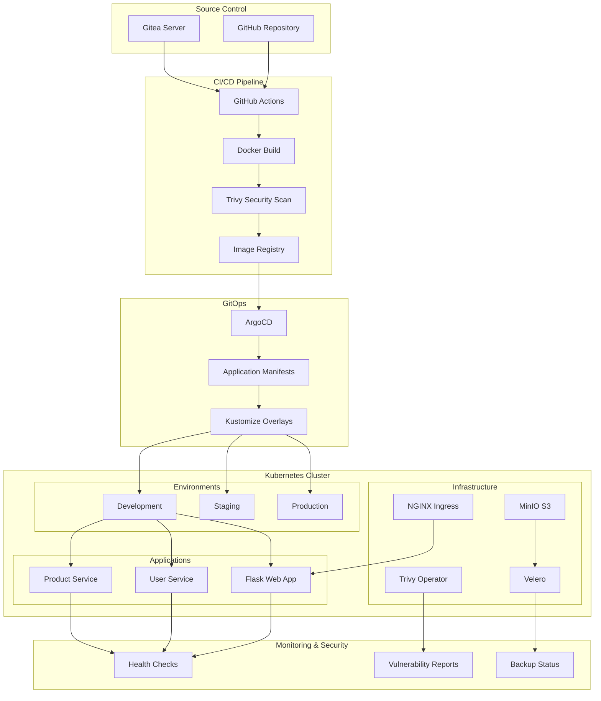
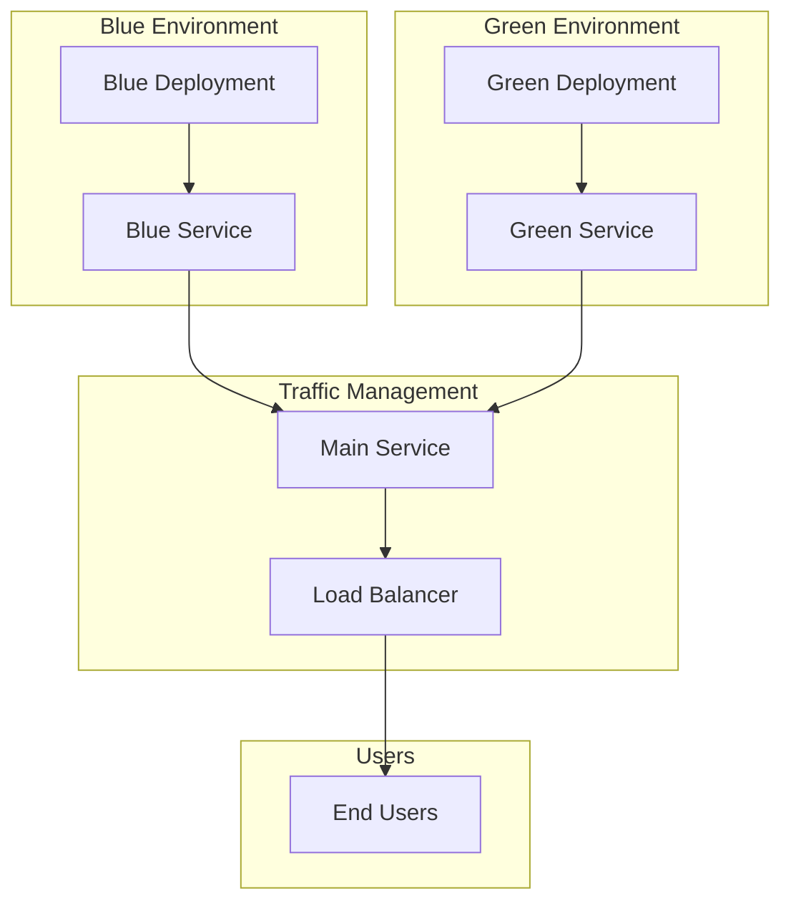

# 🚀 Unified Production-Ready DevOps Pipeline

A comprehensive DevOps ecosystem integrating Flask web application with microservices architecture, featuring GitOps with ArgoCD, automated CI/CD, container security scanning, multi-environment deployment, blue-green strategy, and backup & disaster recovery.

## 📋 Table of Contents

- [Overview](#overview)
- [Architecture](#architecture)
- [Prerequisites](#prerequisites)
- [Quick Start](#quick-start)
- [Detailed Setup](#detailed-setup)
- [Usage](#usage)
- [Access URLs](#access-urls)
- [Manual Deployment and Testing](#manual-deployment-and-testing)
- [Testing Guide](#-testing-guide)
- [Features](#features)
- [Documentation](#documentation)
- [Troubleshooting](#troubleshooting)
- [Complete Command Reference](#-complete-command-reference)
- [Contributing](#contributing)

## 🏗️ Overview

This project implements a complete production-ready DevOps pipeline with the following components:

- **Flask Web Application**: Modern Python web app with Bootstrap UI
- **Microservices Architecture**: User Service and Product Service with REST APIs
- **GitOps Workflow**: ArgoCD for automated deployments
- **Git Server**: Self-hosted Gitea for PoC
- **Container Orchestration**: Kubernetes (kind/k3s)
- **Configuration Management**: Helm and Kustomize
- **Security Scanning**: Trivy CLI (CI) and Trivy Operator (in-cluster)
- **Backup & DR**: Velero with MinIO as S3 backend
- **Deployment Strategy**: Blue-Green Deployments
- **Documentation**: MkDocs-based documentation system

## 🏛️ Architecture

### System Architecture Diagram



### Deployment Flow Diagram


### Blue-Green Deployment Diagram



## 📋 Prerequisites

### System Requirements
- **OS**: Ubuntu 20.04+, Debian 11+, or Amazon Linux 2023+
- **RAM**: Minimum 4GB (8GB recommended)
- **Disk**: Minimum 20GB free space
- **CPU**: 2+ cores recommended
- **Network**: Internet connectivity

### Required Permissions
- Sudo privileges (or run as root user)
- Docker group membership (not required when running as root)
- Kubernetes cluster access

**Note:** All scripts support both regular user with sudo privileges and root user execution. When running as root, sudo commands are automatically skipped.

## 🚀 Quick Start

### One-Command Setup

```bash
# Clone the repository
git clone https://github.com/auspicious27/Project6-testpurpose.git
cd Project6-testpurpose

# Run complete setup (Ubuntu/Debian/Amazon Linux)
chmod +x setup_prereqs.sh bootstrap_cluster.sh deploy_pipeline.sh check_env.sh
./setup_prereqs.sh && ./bootstrap_cluster.sh && ./deploy_pipeline.sh && ./check_env.sh
```

**Note:** 
- The scripts support running as root user on Amazon Linux 2023 or other RHEL-based systems. Sudo commands will be automatically skipped when running as root.
- **For AWS EC2:** The deployment script automatically detects EC2 instances and configures services for external access. After deployment, configure your Security Group with the ports shown in the output.

### Verify Installation

```bash
# Check all components
./check_env.sh

# Expected output: ✅ All health checks passed! 🎉
```

## 📖 Detailed Setup

### Step 1: Install Prerequisites

```bash
# Make script executable
chmod +x setup_prereqs.sh

# Run prerequisites installation
./setup_prereqs.sh
```

**What gets installed:**
- Docker and Docker Compose
- kubectl
- kind (Kubernetes in Docker)
- Helm
- ArgoCD CLI
- Trivy
- Velero
- Kustomize
- MkDocs

### Step 2: Bootstrap Kubernetes Cluster

```bash
# Make script executable
chmod +x bootstrap_cluster.sh

# Bootstrap the cluster
./bootstrap_cluster.sh
```

**What gets created:**
- Kind Kubernetes cluster with 3 nodes
- NGINX Ingress Controller
- Gitea Git server
- ArgoCD GitOps controller
- MinIO S3 storage
- Trivy Operator for security scanning
- Velero for backup and recovery

### Step 3: Deploy Applications

```bash
# Make script executable
chmod +x deploy_pipeline.sh

# Deploy the pipeline
./deploy_pipeline.sh
```

**What gets deployed:**
- Flask web application
- User service microservice
- Product service microservice
- Kubernetes manifests for all environments
- ArgoCD applications
- Ingress resources

### Step 4: Verify Deployment

```bash
# Make script executable
chmod +x check_env.sh

# Run health checks
./check_env.sh
```

**Health checks verify:**
- Cluster status
- All namespaces
- ArgoCD applications
- Infrastructure components
- Application deployments
- Service endpoints

## 🌐 Access URLs

After successful installation, access your applications. The deployment script automatically detects if you're running on AWS EC2 and provides appropriate URLs.

### Local/Development Access

| Service | URL | Credentials |
|---------|-----|-------------|
| **Flask App** | http://flask-app.local | - |
| **Gitea** | http://gitea.local | admin/admin123 |
| **MinIO** | http://minio.local | minioadmin/minioadmin123 |
| **ArgoCD** | http://argocd.local | admin/[see below] |

### AWS EC2 Deployment

When deploying on AWS EC2, the script automatically:
- ✅ Detects EC2 instance (via metadata service)
- ✅ Retrieves Public IP and Private IP
- ✅ Configures services as NodePort for external access
- ✅ Generates working URLs with Public IP
- ✅ Provides Security Group configuration instructions

**After running `./deploy_pipeline.sh` on EC2, you'll see:**

```
━━━━━━━━━━━━━━━━━━━━━━━━━━━━━━━━━━━━━━━━━━━━━━━━━━━━━━━━━━━━━━━━━━━━━━━━━━━━━━━━
🌐 ACCESS URLs (Working URLs):
━━━━━━━━━━━━━━━━━━━━━━━━━━━━━━━━━━━━━━━━━━━━━━━━━━━━━━━━━━━━━━━━━━━━━━━━━━━━━━━━

📱 Flask Application:
   🌐 Public URL (EC2): http://54.123.45.67:31234 (Host: flask-app.local)
   🔗 Local URL: http://172.31.12.34:31234 (Host: flask-app.local)
   🧪 Test Command: curl -H 'Host: flask-app.local' http://54.123.45.67:31234/api/health

🚀 ArgoCD Dashboard:
   🌐 Public URL (EC2): https://54.123.45.67:30443
   👤 Username: admin
   🔑 Password: [auto-generated]

... (and more services)
```

### Get ArgoCD Password

```bash
# Get ArgoCD admin password
kubectl -n argocd get secret argocd-initial-admin-secret -o jsonpath="{.data.password}" | base64 -d && echo
```

### AWS EC2 Security Group Configuration

**⚠️ IMPORTANT:** After deployment on EC2, configure your Security Group to allow inbound traffic on the NodePorts shown in the deployment output.

**Example Security Group Rules:**

| Type | Protocol | Port Range | Source | Description |
|------|----------|------------|--------|-------------|
| Custom TCP | TCP | 30000-32767 | 0.0.0.0/0 | Ingress Controller (HTTP) |
| Custom TCP | TCP | 30000-32767 | 0.0.0.0/0 | Ingress Controller (HTTPS) |
| Custom TCP | TCP | 30000-32767 | 0.0.0.0/0 | ArgoCD Dashboard |
| Custom TCP | TCP | 30000-32767 | 0.0.0.0/0 | Gitea |
| Custom TCP | TCP | 30000-32767 | 0.0.0.0/0 | MinIO |

**AWS CLI Commands:**

```bash
# Get your security group ID
SG_ID=$(aws ec2 describe-instances \
  --instance-ids $(ec2-metadata --instance-id | cut -d ' ' -f2) \
  --query 'Reservations[0].Instances[0].SecurityGroups[0].GroupId' \
  --output text)

# Add rules (replace PORT with actual NodePort from deployment output)
aws ec2 authorize-security-group-ingress \
  --group-id $SG_ID \
  --protocol tcp \
  --port <INGRESS_PORT> \
  --cidr 0.0.0.0/0
```

**Or via AWS Console:**
1. Go to EC2 → Security Groups
2. Select your instance's security group
3. Add Inbound Rules for the ports shown in deployment output
4. Allow traffic from `0.0.0.0/0` (or restrict to your IP for security)

### Port Forwarding (Alternative Access Method)

If you prefer port forwarding instead of NodePort:

```bash
# Flask App
kubectl port-forward -n dev svc/flask-app-service 8080:80

# ArgoCD
kubectl port-forward -n argocd svc/argocd-server 8081:443

# Gitea
kubectl port-forward -n gitea svc/gitea-http 3000:3000

# MinIO
kubectl port-forward -n minio svc/minio 9000:9000
```

Then access via:
- Flask App: http://localhost:8080
- ArgoCD: https://localhost:8081
- Gitea: http://localhost:3000
- MinIO: http://localhost:9000

## 🛠️ Manual Deployment and Testing

If you prefer to deploy and test without running the helper scripts, follow these steps.

### 1) Create a local kind cluster (with Ingress)

```bash
cat > kind-config.yaml << 'EOF'
kind: Cluster
apiVersion: kind.x-k8s.io/v1alpha4
name: devops-pipeline
nodes:
- role: control-plane
  kubeadmConfigPatches:
  - |
    kind: InitConfiguration
    nodeRegistration:
      kubeletExtraArgs:
        node-labels: "ingress-ready=true"
  extraPortMappings:
  - containerPort: 80
    hostPort: 80
    protocol: TCP
  - containerPort: 443
    hostPort: 443
    protocol: TCP
- role: worker
- role: worker
EOF

kind create cluster --config kind-config.yaml
kubectl cluster-info --context kind-devops-pipeline

# Install NGINX Ingress for kind
kubectl apply -f https://raw.githubusercontent.com/kubernetes/ingress-nginx/main/deploy/static/provider/kind/deploy.yaml
kubectl wait --namespace ingress-nginx \
  --for=condition=ready pod \
  --selector=app.kubernetes.io/component=controller \
  --timeout=90s
```

### 2) Build and load images into the cluster

```bash
# Flask app
docker build -t flask-app:latest ./apps/flask-app
kind load docker-image flask-app:latest --name devops-pipeline

# User service
docker build -t user-service:latest ./apps/microservice-1
kind load docker-image user-service:latest --name devops-pipeline

# Product service
docker build -t product-service:latest ./apps/microservice-2
kind load docker-image product-service:latest --name devops-pipeline
```

### 3) Create namespace and deploy workloads

```bash
kubectl create namespace dev || true

# Deploy Flask app
kubectl -n dev apply -f apps/flask-app/deployment.yaml

# Deploy User service
kubectl -n dev apply -f apps/microservice-1/deployment.yaml

# Deploy Product service
kubectl -n dev apply -f apps/microservice-2/deployment.yaml

# Wait for deployments
kubectl -n dev wait --for=condition=available --timeout=300s deployment/flask-app
kubectl -n dev wait --for=condition=available --timeout=300s deployment/user-service
kubectl -n dev wait --for=condition=available --timeout=300s deployment/product-service
```

### 4) Expose Flask via Ingress and add hosts entries

```bash
cat > flask-ingress.yaml << 'EOF'
apiVersion: networking.k8s.io/v1
kind: Ingress
metadata:
  name: flask-app-ingress
  namespace: dev
  annotations:
    nginx.ingress.kubernetes.io/rewrite-target: /
spec:
  rules:
  - host: flask-app.local
    http:
      paths:
      - path: /
        pathType: Prefix
        backend:
          service:
            name: flask-app-service
            port:
              number: 80
EOF

kubectl apply -f flask-ingress.yaml
rm flask-ingress.yaml

# Add local DNS entries (skip sudo if running as root)
if [ "$EUID" -eq 0 ]; then
    echo "127.0.0.1 flask-app.local" | tee -a /etc/hosts
else
    echo "127.0.0.1 flask-app.local" | sudo tee -a /etc/hosts
fi
```

### 5) Test manually

**Local/Development:**
```bash
# App health
curl -s http://flask-app.local/api/health | jq . || curl -s http://flask-app.local/api/health

# Home page
curl -I http://flask-app.local/

# Service-to-service endpoints (inside cluster)
kubectl -n dev run tmp --rm -it --image=curlimages/curl -- /bin/sh -lc \
  'curl -s http://user-service-service/api/users && echo && curl -s http://product-service-service/api/products && echo'
```

**AWS EC2:**
```bash
# Get EC2 Public IP and Ingress Port
PUBLIC_IP=$(curl -s http://169.254.169.254/latest/meta-data/public-ipv4)
INGRESS_PORT=$(kubectl get svc -n ingress-nginx ingress-nginx-controller -o jsonpath='{.spec.ports[?(@.port==80)].nodePort}')

# App health (from EC2)
curl -H 'Host: flask-app.local' http://$PUBLIC_IP:$INGRESS_PORT/api/health

# Home page (from EC2)
curl -H 'Host: flask-app.local' -I http://$PUBLIC_IP:$INGRESS_PORT/

# Service-to-service endpoints (inside cluster)
kubectl -n dev run tmp --rm -it --image=curlimages/curl -- /bin/sh -lc \
  'curl -s http://user-service-service/api/users && echo && curl -s http://product-service-service/api/products && echo'
```

Notes:
- The manual flow above deploys only the sample apps. For GitOps, Gitea, ArgoCD, MinIO, Trivy Operator, and Velero, use the provided scripts or replicate the Helm installs and manifests from `bootstrap_cluster.sh` and `deploy_pipeline.sh`.

## 🎯 Usage

### Test the Pipeline

#### 1. Blue-Green Deployment Demo

```bash
# Run blue-green deployment demo
./switch_blue_green.sh demo
```

#### 2. Backup and Restore Demo

```bash
# Run backup and restore demo
./backup_restore_demo.sh demo
```

#### 3. Security Scan Demo

```bash
# Scan Flask app
trivy image --severity HIGH,CRITICAL flask-app:latest

# Scan User service
trivy image --severity HIGH,CRITICAL user-service:latest

# Scan Product service
trivy image --severity HIGH,CRITICAL product-service:latest
```

### Monitor Applications

#### Check Application Status

```bash
# Check all pods
kubectl get pods -A

# Check ArgoCD applications
kubectl get applications -n argocd

# Check services
kubectl get services -A
```

#### View Application Logs

```bash
# Flask app logs
kubectl logs -n dev deployment/flask-app

# User service logs
kubectl logs -n dev deployment/user-service

# Product service logs
kubectl logs -n dev deployment/product-service
```

### Access Applications

#### Flask Web Application

**Local/Development:**
```bash
# Access via browser
open http://flask-app.local

# Or via curl
curl http://flask-app.local/api/health

# Test home page
curl http://flask-app.local/
```

**AWS EC2 (After deployment):**
```bash
# Get your EC2 Public IP and Ingress Port from deploy_pipeline.sh output
# Example: Public IP: 54.123.45.67, Ingress Port: 31234

# Test Flask App (replace with your actual IP and port)
PUBLIC_IP=$(curl -s http://169.254.169.254/latest/meta-data/public-ipv4)
INGRESS_PORT=$(kubectl get svc -n ingress-nginx ingress-nginx-controller -o jsonpath='{.spec.ports[?(@.port==80)].nodePort}')

# Test health endpoint
curl -H 'Host: flask-app.local' http://$PUBLIC_IP:$INGRESS_PORT/api/health

# Test home page
curl -H 'Host: flask-app.local' http://$PUBLIC_IP:$INGRESS_PORT/

# Or from your local machine (replace with EC2 Public IP)
curl -H 'Host: flask-app.local' http://<EC2_PUBLIC_IP>:<NODEPORT>/api/health
```

#### Microservices APIs

**From inside cluster:**
```bash
# User service API (from inside cluster)
kubectl -n dev run test-user --rm -it --image=curlimages/curl --restart=Never -- \
  sh -c 'curl -s http://user-service-service/api/users'

# Product service API (from inside cluster)
kubectl -n dev run test-product --rm -it --image=curlimages/curl --restart=Never -- \
  sh -c 'curl -s http://product-service-service/api/products'
```

**Via Port Forward (Local):**
```bash
# User Service
kubectl port-forward -n dev svc/user-service-service 5001:80
# Then: curl http://localhost:5001/api/users

# Product Service
kubectl port-forward -n dev svc/product-service-service 5002:80
# Then: curl http://localhost:5002/api/products
```

## 🧪 Testing Guide

This section provides comprehensive testing instructions for both project maintainers and students.

### 📋 Pre-Testing Checklist

Before running tests, ensure:
- All prerequisites are installed (`./setup_prereqs.sh` completed successfully)
- Kubernetes cluster is running (`kind get clusters` shows `devops-pipeline`)
- All components are deployed (`./deploy_pipeline.sh` completed successfully)

### 🔍 Running Health Checks

The primary way to test the entire environment is using the health check script:

```bash
# Make script executable (if not already)
chmod +x check_env.sh

# Run comprehensive health checks
./check_env.sh
```

**Expected Output:**
- ✅ All required commands are installed (kubectl, kind, helm, argocd, trivy, velero)
- ✅ Kubernetes cluster is running and all nodes are ready
- ✅ All namespaces exist (argocd, gitea, minio, trivy-system, velero, dev, staging, production)
- ✅ All infrastructure components are running (ArgoCD, Gitea, MinIO, Trivy Operator, Velero)
- ✅ Applications are deployed and running
- ✅ Ingress controller is running
- ✅ Health report is generated

**Understanding the Output:**
- `[SUCCESS]` - Component is healthy and working
- `[WARNING]` - Component exists but may not be fully ready (non-critical)
- `[ERROR]` - Component is missing or not working (needs attention)

### 🎓 For Students: Step-by-Step Testing

#### Step 1: Verify Prerequisites

```bash
# Check if all tools are installed
kubectl version --client
kind version
helm version
argocd version --client
trivy --version
velero version --client
```

#### Step 2: Check Cluster Status

```bash
# Verify cluster is running
kind get clusters

# Check cluster nodes
kubectl get nodes

# Verify cluster connectivity
kubectl cluster-info
```

#### Step 3: Verify Namespaces

```bash
# List all namespaces
kubectl get namespaces

# Expected namespaces:
# - argocd
# - gitea
# - minio
# - trivy-system
# - velero
# - dev
# - staging
# - production
```

#### Step 4: Check Infrastructure Components

```bash
# Check ArgoCD
kubectl get pods -n argocd
kubectl get applications -n argocd

# Check Gitea
kubectl get pods -n gitea

# Check MinIO
kubectl get pods -n minio

# Check Trivy Operator
kubectl get pods -n trivy-system

# Check Velero
kubectl get pods -n velero
```

#### Step 5: Verify Applications

```bash
# Check applications in dev namespace
kubectl get deployments -n dev
kubectl get pods -n dev
kubectl get services -n dev

# Expected applications:
# - flask-app
# - user-service
# - product-service
```

#### Step 6: Test Application Endpoints

**Local/Development:**
```bash
# Test Flask app health endpoint
curl http://flask-app.local/api/health

# Test Flask app home page
curl http://flask-app.local/

# Test from inside cluster (if services are not exposed)
kubectl -n dev run test-curl --rm -it --image=curlimages/curl --restart=Never -- \
  sh -c 'curl -s http://flask-app-service/api/health'
```

**AWS EC2:**
```bash
# Get EC2 Public IP and Ingress Port
PUBLIC_IP=$(curl -s http://169.254.169.254/latest/meta-data/public-ipv4)
INGRESS_PORT=$(kubectl get svc -n ingress-nginx ingress-nginx-controller -o jsonpath='{.spec.ports[?(@.port==80)].nodePort}')

# Test Flask app health endpoint (from EC2)
curl -H 'Host: flask-app.local' http://$PUBLIC_IP:$INGRESS_PORT/api/health

# Test Flask app home page (from EC2)
curl -H 'Host: flask-app.local' http://$PUBLIC_IP:$INGRESS_PORT/

# Test from your local machine (replace with actual values)
curl -H 'Host: flask-app.local' http://<EC2_PUBLIC_IP>:<NODEPORT>/api/health
```

#### Step 7: Access Web UIs

**Local/Development (Port Forwarding):**
```bash
# Get ArgoCD admin password
kubectl -n argocd get secret argocd-initial-admin-secret -o jsonpath="{.data.password}" | base64 -d && echo

# Port forward to access UIs locally
# ArgoCD (in one terminal)
kubectl port-forward -n argocd service/argocd-server 8080:443

# Gitea (in another terminal)
kubectl port-forward -n gitea service/gitea-http 3000:3000

# MinIO (in another terminal)
kubectl port-forward -n minio service/minio 9000:9000
```

Then access:
- ArgoCD: https://localhost:8080 (admin / [password from above])
- Gitea: http://localhost:3000 (admin / admin123)
- MinIO: http://localhost:9000 (minioadmin / minioadmin123)

**AWS EC2 (Direct Access via Public IP):**
```bash
# Get EC2 Public IP
PUBLIC_IP=$(curl -s http://169.254.169.254/latest/meta-data/public-ipv4)

# Get NodePorts (from deploy_pipeline.sh output or manually)
ARGOCD_PORT=$(kubectl get svc -n argocd argocd-server -o jsonpath='{.spec.ports[?(@.name=="https")].nodePort}')
GITEA_PORT=$(kubectl get svc -n gitea gitea-http -o jsonpath='{.spec.ports[?(@.name=="http")].nodePort}')
MINIO_PORT=$(kubectl get svc -n minio minio -o jsonpath='{.spec.ports[?(@.name=="api")].nodePort}')

# Get ArgoCD password
ARGOCD_PASSWORD=$(kubectl -n argocd get secret argocd-initial-admin-secret -o jsonpath="{.data.password}" | base64 -d)

echo "━━━━━━━━━━━━━━━━━━━━━━━━━━━━━━━━━━━━━━━━━━━━━━━━━━━━━━━━━━━━━━━━━━━━━━━━━━━━━━━━"
echo "🌐 EC2 Access URLs:"
echo "━━━━━━━━━━━━━━━━━━━━━━━━━━━━━━━━━━━━━━━━━━━━━━━━━━━━━━━━━━━━━━━━━━━━━━━━━━━━━━━━"
echo "ArgoCD:  https://$PUBLIC_IP:$ARGOCD_PORT (admin / $ARGOCD_PASSWORD)"
echo "Gitea:   http://$PUBLIC_IP:$GITEA_PORT (admin / admin123)"
echo "MinIO:   http://$PUBLIC_IP:$MINIO_PORT (minioadmin / minioadmin123)"
echo "━━━━━━━━━━━━━━━━━━━━━━━━━━━━━━━━━━━━━━━━━━━━━━━━━━━━━━━━━━━━━━━━━━━━━━━━━━━━━━━━"
```

**⚠️ Important:** Before accessing from browser, ensure Security Group allows inbound traffic on these ports!

### 🧪 Advanced Testing

#### Test Blue-Green Deployment

```bash
# Run blue-green deployment demo
chmod +x switch_blue_green.sh
./switch_blue_green.sh demo
```

This will:
- Create blue and green deployments
- Switch traffic between them
- Validate health checks
- Demonstrate zero-downtime deployment

#### Test Backup and Restore

```bash
# Run backup/restore demo
chmod +x backup_restore_demo.sh
./backup_restore_demo.sh demo
```

This will:
- Create a backup of the cluster
- Simulate data loss
- Restore from backup
- Verify data integrity

#### Test Security Scanning

```bash
# Scan Flask app image
trivy image --severity HIGH,CRITICAL flask-app:latest

# Scan User service image
trivy image --severity HIGH,CRITICAL user-service:latest

# Scan Product service image
trivy image --severity HIGH,CRITICAL product-service:latest

# Check in-cluster vulnerability reports
kubectl get vulnerabilityreports -A
```

### 📊 Interpreting Test Results

#### Successful Test Results

A successful test should show:
- ✅ All health checks pass
- ✅ All pods are in `Running` state
- ✅ All services are accessible
- ✅ Applications respond to HTTP requests
- ✅ ArgoCD applications are `Healthy` and `Synced`

#### Common Issues and Solutions

**Issue: Pods not starting**
```bash
# Check pod status
kubectl describe pod <pod-name> -n <namespace>

# Check pod logs
kubectl logs <pod-name> -n <namespace>

# Check events
kubectl get events -n <namespace> --sort-by='.lastTimestamp'
```

**Issue: Services not accessible**
```bash
# Check service endpoints
kubectl get endpoints -n <namespace>

# Check ingress
kubectl get ingress -A

# Verify DNS/hosts file
cat /etc/hosts | grep flask-app.local
```

**Issue: ArgoCD not syncing**
```bash
# Check ArgoCD application status
kubectl get applications -n argocd

# Manually sync application
argocd app sync devops-pipeline-dev

# Check ArgoCD logs
kubectl logs -n argocd deployment/argocd-application-controller
```

### 📝 Test Report Template

After running tests, document your results:

```markdown
## Test Report

**Date:** [Date]
**Tester:** [Your Name]
**Environment:** [Dev/Staging/Production]

### Prerequisites
- [ ] All tools installed
- [ ] Cluster running
- [ ] Components deployed

### Health Checks
- [ ] All commands available
- [ ] Cluster healthy
- [ ] All namespaces exist
- [ ] Infrastructure components running
- [ ] Applications deployed

### Functional Tests
- [ ] Flask app accessible
- [ ] User service responding
- [ ] Product service responding
- [ ] ArgoCD UI accessible
- [ ] Gitea UI accessible
- [ ] MinIO UI accessible

### Advanced Tests
- [ ] Blue-green deployment works
- [ ] Backup/restore works
- [ ] Security scanning works

### Issues Found
[List any issues encountered]

### Notes
[Additional observations]
```

### 🎯 Quick Test Commands

For quick verification, run these commands:

```bash
# Quick health check
./check_env.sh | grep -E "(SUCCESS|ERROR)"

# Check all pods status
kubectl get pods -A | grep -v Running

# Check all services
kubectl get services -A

# Check ingress
kubectl get ingress -A

# Test Flask app
curl -s http://flask-app.local/api/health | jq . || curl -s http://flask-app.local/api/health
```

**AWS EC2:**
```bash
# Quick health check
./check_env.sh | grep -E "(SUCCESS|ERROR)"

# Get EC2 Public IP and Ports
PUBLIC_IP=$(curl -s http://169.254.169.254/latest/meta-data/public-ipv4)
INGRESS_PORT=$(kubectl get svc -n ingress-nginx ingress-nginx-controller -o jsonpath='{.spec.ports[?(@.port==80)].nodePort}')

# Check all pods status
kubectl get pods -A | grep -v Running

# Check all services (verify NodePort types)
kubectl get services -A | grep -E "NodePort|LoadBalancer"

# Check all ingress
kubectl get ingress -A

# Test Flask app (from EC2)
curl -H 'Host: flask-app.local' http://$PUBLIC_IP:$INGRESS_PORT/api/health

# Test from local machine (replace with your EC2 IP)
curl -H 'Host: flask-app.local' http://<EC2_PUBLIC_IP>:<NODEPORT>/api/health
```

### 📚 Additional Resources

- **Health Report**: Generated automatically by `check_env.sh` in `health-report-*.txt`
- **Logs**: Check component logs using `kubectl logs`
- **Documentation**: See `/docs` directory for detailed guides
- **Troubleshooting**: See [Troubleshooting](#-troubleshooting) section

## ✨ Features

### 🔄 GitOps Workflow
- ArgoCD-managed deployments from Git
- Automated sync for development
- Manual approval for staging and production
- Kustomize overlays for environment-specific configurations

### 🔒 Security Integration
- Container vulnerability scanning with Trivy
- Security reports in CI/CD pipeline
- In-cluster security monitoring
- RBAC configurations for Kubernetes

### 🔄 Blue-Green Deployments
- Zero-downtime deployments
- Automated traffic switching
- Rollback capabilities
- Health check validation

### 💾 Backup & Recovery
- Automated backups with Velero
- S3-compatible storage with MinIO
- Disaster recovery testing
- Cross-environment restore capabilities

### 🌍 Multi-Environment Support
- Development, staging, and production environments
- Environment-specific resource scaling
- Separate secrets and configurations
- Automated promotion pipeline

### 📊 Monitoring & Observability
- Comprehensive health checks
- Application metrics endpoints
- Infrastructure monitoring
- Log aggregation and analysis

## 📚 Documentation

The project includes comprehensive documentation:

### 📖 Main Documentation
- **[Architecture Overview](docs/architecture.md)**: Detailed system architecture
- **[Quick Start Guide](docs/quick-start.md)**: Get started in minutes
- **[Security Guide](docs/security.md)**: Security best practices
- **[Monitoring Guide](docs/monitoring.md)**: Monitoring and observability
- **[Troubleshooting Guide](docs/troubleshooting.md)**: Common issues and solutions
- **[API Reference](docs/api-reference.md)**: Complete API documentation

### 📋 Runbooks
- **[Installation Runbook](docs/runbooks/installation.md)**: Step-by-step installation
- **[CI/CD Pipeline Runbook](docs/runbooks/cicd-pipeline.md)**: Pipeline procedures
- **[GitOps Sync Runbook](docs/runbooks/gitops-sync.md)**: GitOps synchronization
- **[Blue-Green Switch Runbook](docs/runbooks/blue-green-switch.md)**: Blue-green deployment
- **[DR Restore Runbook](docs/runbooks/dr-restore.md)**: Disaster recovery procedures

### 📖 Generate Documentation

```bash
# Install MkDocs
pip install mkdocs mkdocs-material

# Serve documentation locally
cd docs
mkdocs serve

# Access at http://localhost:8000
```

## 🔧 Project Structure

```
devops-pipeline/
├── 📁 apps/                          # Application definitions
│   ├── 📁 flask-app/                # Flask web application
│   │   ├── 🐳 Dockerfile
│   │   ├── 🐍 app.py
│   │   ├── 📄 requirements.txt
│   │   ├── 📄 deployment.yaml
│   │   └── 📁 templates/
│   ├── 📁 microservice-1/           # User service
│   │   ├── 🐳 Dockerfile
│   │   ├── 🐍 app.py
│   │   ├── 📄 requirements.txt
│   │   └── 📄 deployment.yaml
│   └── 📁 microservice-2/           # Product service
│       ├── 🐳 Dockerfile
│       ├── 🐍 app.py
│       ├── 📄 requirements.txt
│       └── 📄 deployment.yaml
├── 📁 environments/                  # Environment configurations
│   ├── 📁 dev/                      # Development environment
│   ├── 📁 staging/                  # Staging environment
│   └── 📁 prod/                     # Production environment
├── 📁 argocd/                       # ArgoCD configurations
│   ├── 📄 argocd-apps.yaml
│   └── 📄 project.yaml
├── 📁 docs/                         # Documentation
│   ├── 📄 mkdocs.yml
│   ├── 📄 index.md
│   ├── 📄 architecture.md
│   └── 📁 runbooks/
├── 📁 .github/workflows/            # CI/CD workflows
│   └── 📄 ci-cd.yml
├── 🔧 setup_prereqs.sh              # Prerequisites installation
├── 🔧 bootstrap_cluster.sh          # Cluster bootstrap
├── 🔧 deploy_pipeline.sh            # Pipeline deployment
├── 🔧 switch_blue_green.sh          # Blue-green switching
├── 🔧 backup_restore_demo.sh        # Backup/restore demo
├── 🔧 check_env.sh                  # Health checks
└── 📄 README.md                     # This file
```

### Expected Output

When running `./setup_prereqs.sh`, you should see:

```
🚀 Setting up prerequisites for Unified DevOps Pipeline...
[WARNING] Running as root. Sudo commands will be skipped.
[INFO] Detecting package manager...
[INFO] Updating system packages...
[INFO] Installing basic dependencies...
[INFO] Installing Docker...
[SUCCESS] Docker installed successfully
[INFO] Installing kubectl...
[SUCCESS] kubectl installed successfully
[INFO] Installing kind...
[SUCCESS] kind installed successfully
[INFO] Installing Helm...
[SUCCESS] Helm installed successfully
[INFO] Installing ArgoCD CLI...
[SUCCESS] ArgoCD CLI installed successfully
[INFO] Installing Trivy...
[SUCCESS] Trivy installed successfully
[INFO] Installing Velero...
[SUCCESS] Velero installed successfully
[INFO] Installing Kustomize...
[SUCCESS] Kustomize installed successfully
[INFO] Installing MkDocs...
[SUCCESS] MkDocs installed successfully
[SUCCESS] All prerequisites installed successfully!
```

**Note:** MkDocs installation may show warnings about RPM-installed packages (like `requests`), but this is non-critical and the script will continue.

When running `./bootstrap_cluster.sh`, you should see:

```
🚀 Bootstrapping Kubernetes cluster with DevOps components...
[INFO] Creating kind cluster configuration...
[INFO] Creating kind cluster: devops-pipeline
Creating cluster "devops-pipeline" ...
 ✓ Ensuring node image (kindest/node:v1.27.3) 🖼 
 ✓ Preparing nodes 📦 📦 📦  
 ✓ Writing configuration 📜 
 ✓ Starting control-plane 🕹️ 
 ✓ Installing CNI 🔌 
[INFO] Setting kubectl context...
[INFO] Waiting for cluster to be ready...
[SUCCESS] Cluster is ready!
[INFO] Installing NGINX Ingress Controller...
[INFO] Creating namespaces...
[INFO] Installing Gitea...
[INFO] Installing ArgoCD...
[INFO] Installing MinIO...
[INFO] Installing Trivy Operator...
[INFO] Installing Velero...
[SUCCESS] Cluster bootstrap completed successfully!
```

**Note:** 
- Storage class errors during cluster creation are non-critical and can be ignored
- Worker node join errors are handled automatically - script will use single-node cluster
- If cluster creation fails, script will automatically try fallback method
- Single-node cluster is used for better reliability and resource efficiency

## 🚨 Troubleshooting

### Common Issues

#### Kind Cluster Creation Errors

**Error:** `failed to add default storage class` or `Storage class timeout`

**Solution:** This is a non-critical error. The cluster will still be functional. If you see this error:

```bash
# The script will continue despite storage class errors
# Verify cluster is working:
kubectl get nodes
kubectl cluster-info

# If cluster is not ready, restart Docker and retry:
systemctl restart docker
kind delete cluster --name devops-pipeline
./bootstrap_cluster.sh
```

**Error:** `failed to join node with kubeadm` or `kubelet isn't running or healthy`

**Solution:** This happens when worker nodes fail to join. The script now uses a single-node cluster (control-plane only) which is more reliable. If you still see this:

```bash
# Clean up and retry:
kind delete cluster --name devops-pipeline
docker system prune -f
systemctl restart docker
./bootstrap_cluster.sh
```

**Error:** `kubectl: connection refused` or `dial tcp 127.0.0.1:8080: connect: connection refused`

**Solution:** This means kubectl context is not set properly. The script now handles this automatically with fallback methods, but if you see this:

```bash
# Manually set the context:
kind get kubeconfig --name devops-pipeline > ~/.kube/config
kubectl config use-context kind-devops-pipeline

# Verify:
kubectl get nodes
```

**Error:** `failed calling webhook "validate.nginx.ingress.kubernetes.io"` or `webhook connection refused`

**Solution:** This happens when NGINX Ingress webhook is not ready. The script now:
- Waits for webhook to be ready before installing Gitea
- Falls back to installing Gitea without ingress if webhook fails
- You can manually add ingress later if needed

If you see this error, the script will handle it automatically. Gitea will still install successfully.

**Error:** `TLS handshake timeout` during ArgoCD installation

**Solution:** The script now:
- Downloads ArgoCD manifests locally first
- Disables validation to avoid timeout issues
- Waits for API server to be stable before installation
- Retries automatically if first attempt fails

If you still see this:
```bash
# Check cluster health:
kubectl get nodes
kubectl cluster-info

# Wait a bit and retry ArgoCD installation:
kubectl apply -n argocd --validate=false -f https://raw.githubusercontent.com/argoproj/argo-cd/stable/manifests/install.yaml
```

#### Installation Issues

```bash
# Docker permission denied
sudo usermod -aG docker $USER
# Log out and log back in

# Kind cluster creation fails
sudo systemctl restart docker
kind delete cluster --name devops-pipeline
kind create cluster --name devops-pipeline
```

#### MkDocs Installation Warnings

**Warning:** `Cannot uninstall requests 2.25.1` (RPM-installed package)

**Solution:** This warning is non-critical. The script handles it automatically using `--break-system-packages` flag. MkDocs will install successfully despite the warning.

#### Application Issues

```bash
# Pod not starting
kubectl describe pod -n dev <pod-name>
kubectl logs -n dev <pod-name>

# Service not accessible
kubectl get services -n dev
kubectl get endpoints -n dev
```

#### ArgoCD Issues

```bash
# Application not syncing
kubectl get applications -n argocd
argocd app sync devops-pipeline-dev --force

# Cannot access ArgoCD UI
kubectl port-forward -n argocd service/argocd-server 8080:443
```

#### AWS EC2 Deployment Issues

**Issue:** URLs not accessible from outside EC2

**Solution:**
1. Check Security Group rules - ensure NodePorts are open
2. Verify services are NodePort type:
   ```bash
   kubectl get svc -n ingress-nginx ingress-nginx-controller
   kubectl get svc -n gitea gitea-http
   kubectl get svc -n minio minio
   ```
3. Get actual NodePorts:
   ```bash
   kubectl get svc -A -o jsonpath='{range .items[*]}{.metadata.namespace}{"\t"}{.metadata.name}{"\t"}{.spec.type}{"\t"}{range .spec.ports[*]}{.nodePort}{"\n"}{end}{end}' | grep NodePort
   ```
4. Add Security Group rules for the ports shown above

**Issue:** EC2 Public IP not detected

**Solution:**
```bash
# Manually get EC2 public IP
PUBLIC_IP=$(curl -s http://169.254.169.254/latest/meta-data/public-ipv4)
echo "Public IP: $PUBLIC_IP"

# Or use external service
PUBLIC_IP=$(curl -s https://api.ipify.org)
echo "Public IP: $PUBLIC_IP"
```

**Issue:** Services not accessible via Public IP

**Solution:**
1. Ensure Security Group allows inbound traffic on NodePorts
2. Check if services are running:
   ```bash
   kubectl get pods -A
   kubectl get svc -A
   ```
3. Test from EC2 instance itself:
   ```bash
   curl -H 'Host: flask-app.local' http://$(curl -s http://169.254.169.254/latest/meta-data/public-ipv4):<NODEPORT>/api/health
   ```

### Health Check Commands

```bash
# Check cluster status
kubectl cluster-info
kubectl get nodes

# Check all resources
kubectl get all -A

# Check specific components
kubectl get pods -n argocd
kubectl get pods -n gitea
kubectl get pods -n minio
```

### Reset Installation

```bash
# Delete cluster and start over
kind delete cluster --name devops-pipeline
docker system prune -a
./bootstrap_cluster.sh
```

## 🔒 Security Considerations

### Production Deployment

For production deployment, consider:

1. **Replace MinIO** with cloud storage (AWS S3, GCS)
2. **Use external secrets management** (AWS Secrets Manager, HashiCorp Vault)
3. **Enable TLS** for all services
4. **Configure network policies** for pod-to-pod communication
5. **Set up monitoring** (Prometheus, Grafana)
6. **Implement log aggregation** (ELK stack, Fluentd)

### Security Features

- Container vulnerability scanning with Trivy
- RBAC configurations for Kubernetes
- Network policies for service isolation
- Secrets management with Kubernetes secrets
- Image signing and verification workflows

## 🤝 Contributing

### Development Setup

```bash
# Fork the repository
git clone https://github.com/auspicious27/Project6-testpurpose.git
cd Project6-testpurpose

# Create feature branch
git checkout -b feature/new-feature

# Make changes and test
./check_env.sh

# Commit changes
git commit -m "feat: add new feature"
git push origin feature/new-feature
```

### Testing

```bash
# Run health checks
./check_env.sh

# Test blue-green deployment
./switch_blue_green.sh demo

# Test backup/restore
./backup_restore_demo.sh demo
```

## 📚 Complete Command Reference

### Setup Commands

```bash
# Complete setup (one command)
git clone https://github.com/auspicious27/Project6-testpurpose.git
cd Project6-testpurpose
chmod +x *.sh
./setup_prereqs.sh && ./bootstrap_cluster.sh && ./deploy_pipeline.sh && ./check_env.sh
```

### EC2 Deployment Commands

```bash
# On AWS EC2 - Complete deployment
git clone https://github.com/auspicious27/Project6-testpurpose.git
cd Project6-testpurpose
chmod +x *.sh
./setup_prereqs.sh && ./bootstrap_cluster.sh && ./deploy_pipeline.sh

# After deployment, get URLs and configure Security Group
# URLs will be shown in deploy_pipeline.sh output
# Configure Security Group with ports shown in output
```

### Get EC2 Information

```bash
# Get EC2 Public IP
curl -s http://169.254.169.254/latest/meta-data/public-ipv4

# Get EC2 Private IP
curl -s http://169.254.169.254/latest/meta-data/local-ipv4

# Get EC2 Instance ID
ec2-metadata --instance-id | cut -d ' ' -f2

# Get Security Group ID
aws ec2 describe-instances \
  --instance-ids $(ec2-metadata --instance-id | cut -d ' ' -f2) \
  --query 'Reservations[0].Instances[0].SecurityGroups[0].GroupId' \
  --output text
```

### Get Service Ports

```bash
# Get Ingress Controller NodePort
kubectl get svc -n ingress-nginx ingress-nginx-controller -o jsonpath='{.spec.ports[?(@.port==80)].nodePort}'

# Get ArgoCD NodePort
kubectl get svc -n argocd argocd-server -o jsonpath='{.spec.ports[?(@.name=="https")].nodePort}'

# Get Gitea NodePort
kubectl get svc -n gitea gitea-http -o jsonpath='{.spec.ports[?(@.name=="http")].nodePort}'

# Get MinIO NodePort
kubectl get svc -n minio minio -o jsonpath='{.spec.ports[?(@.name=="api")].nodePort}'

# Get all NodePorts at once
kubectl get svc -A -o jsonpath='{range .items[*]}{.metadata.namespace}{"\t"}{.metadata.name}{"\t"}{.spec.type}{"\t"}{range .spec.ports[*]}{.nodePort}{"\n"}{end}{end}' | grep NodePort
```

### Test URLs (EC2)

```bash
# Get all info at once
PUBLIC_IP=$(curl -s http://169.254.169.254/latest/meta-data/public-ipv4)
INGRESS_PORT=$(kubectl get svc -n ingress-nginx ingress-nginx-controller -o jsonpath='{.spec.ports[?(@.port==80)].nodePort}')
ARGOCD_PORT=$(kubectl get svc -n argocd argocd-server -o jsonpath='{.spec.ports[?(@.name=="https")].nodePort}')
GITEA_PORT=$(kubectl get svc -n gitea gitea-http -o jsonpath='{.spec.ports[?(@.name=="http")].nodePort}')
MINIO_PORT=$(kubectl get svc -n minio minio -o jsonpath='{.spec.ports[?(@.name=="api")].nodePort}')

# Test Flask App
curl -H 'Host: flask-app.local' http://$PUBLIC_IP:$INGRESS_PORT/api/health

# Test ArgoCD
curl -k https://$PUBLIC_IP:$ARGOCD_PORT/api/version

# Test Gitea
curl http://$PUBLIC_IP:$GITEA_PORT/api/v1/version

# Test MinIO
curl http://$PUBLIC_IP:$MINIO_PORT/minio/health/live
```

### Security Group Configuration (AWS CLI)

```bash
# Get Security Group ID
SG_ID=$(aws ec2 describe-instances \
  --instance-ids $(ec2-metadata --instance-id | cut -d ' ' -f2) \
  --query 'Reservations[0].Instances[0].SecurityGroups[0].GroupId' \
  --output text)

# Get all NodePorts
INGRESS_PORT=$(kubectl get svc -n ingress-nginx ingress-nginx-controller -o jsonpath='{.spec.ports[?(@.port==80)].nodePort}')
INGRESS_HTTPS_PORT=$(kubectl get svc -n ingress-nginx ingress-nginx-controller -o jsonpath='{.spec.ports[?(@.port==443)].nodePort}')
ARGOCD_PORT=$(kubectl get svc -n argocd argocd-server -o jsonpath='{.spec.ports[?(@.name=="https")].nodePort}')
GITEA_PORT=$(kubectl get svc -n gitea gitea-http -o jsonpath='{.spec.ports[?(@.name=="http")].nodePort}')
MINIO_PORT=$(kubectl get svc -n minio minio -o jsonpath='{.spec.ports[?(@.name=="api")].nodePort}')

# Add Security Group rules
aws ec2 authorize-security-group-ingress --group-id $SG_ID --protocol tcp --port $INGRESS_PORT --cidr 0.0.0.0/0
aws ec2 authorize-security-group-ingress --group-id $SG_ID --protocol tcp --port $INGRESS_HTTPS_PORT --cidr 0.0.0.0/0
aws ec2 authorize-security-group-ingress --group-id $SG_ID --protocol tcp --port $ARGOCD_PORT --cidr 0.0.0.0/0
aws ec2 authorize-security-group-ingress --group-id $SG_ID --protocol tcp --port $GITEA_PORT --cidr 0.0.0.0/0
aws ec2 authorize-security-group-ingress --group-id $SG_ID --protocol tcp --port $MINIO_PORT --cidr 0.0.0.0/0
```

### Common Operations

```bash
# Check cluster status
kubectl cluster-info
kubectl get nodes

# Check all resources
kubectl get all -A

# Check specific namespace
kubectl get all -n dev

# View logs
kubectl logs -n dev deployment/flask-app
kubectl logs -n argocd deployment/argocd-server

# Get ArgoCD password
kubectl -n argocd get secret argocd-initial-admin-secret -o jsonpath="{.data.password}" | base64 -d && echo

# Port forwarding (local access)
kubectl port-forward -n dev svc/flask-app-service 8080:80
kubectl port-forward -n argocd svc/argocd-server 8081:443
kubectl port-forward -n gitea svc/gitea-http 3000:3000
kubectl port-forward -n minio svc/minio 9000:9000

# Restart deployments
kubectl rollout restart deployment/flask-app -n dev
kubectl rollout restart deployment/user-service -n dev
kubectl rollout restart deployment/product-service -n dev

# Scale deployments
kubectl scale deployment/flask-app --replicas=3 -n dev

# Delete and recreate
kubectl delete deployment flask-app -n dev
kubectl apply -f apps/flask-app/deployment.yaml
```

## 📄 License

This project is licensed under the MIT License - see the [LICENSE](LICENSE) file for details.

## 🆘 Support

### Getting Help

- **Documentation**: Check the comprehensive docs in `/docs`
- **Troubleshooting**: Use the troubleshooting guide
- **Health Checks**: Run `./check_env.sh` for diagnostics
- **Issues**: Create an issue in the GitHub repository

### Community

- **GitHub Issues**: [Report bugs and request features](https://github.com/auspicious27/Project6-testpurpose/issues)
- **GitHub Discussions**: [Ask questions and share ideas](https://github.com/auspicious27/Project6-testpurpose/discussions)

---

## 🎉 Success!

**Congratulations! You now have a complete, production-ready DevOps pipeline that unifies Flask web application and microservices architecture under GitOps with ArgoCD, full CI/CD automation, vulnerability scanning, blue-green deployment, and production-ready capabilities.**

### Next Steps

1. **Deploy**: Run the setup scripts on your Ubuntu/Debian/Amazon Linux system
2. **Customize**: Modify configurations for your specific needs
3. **Scale**: Add more applications and environments
4. **Monitor**: Set up additional monitoring and alerting
5. **Secure**: Implement additional security measures for production

---

**Made with ❤️ for the DevOps community**